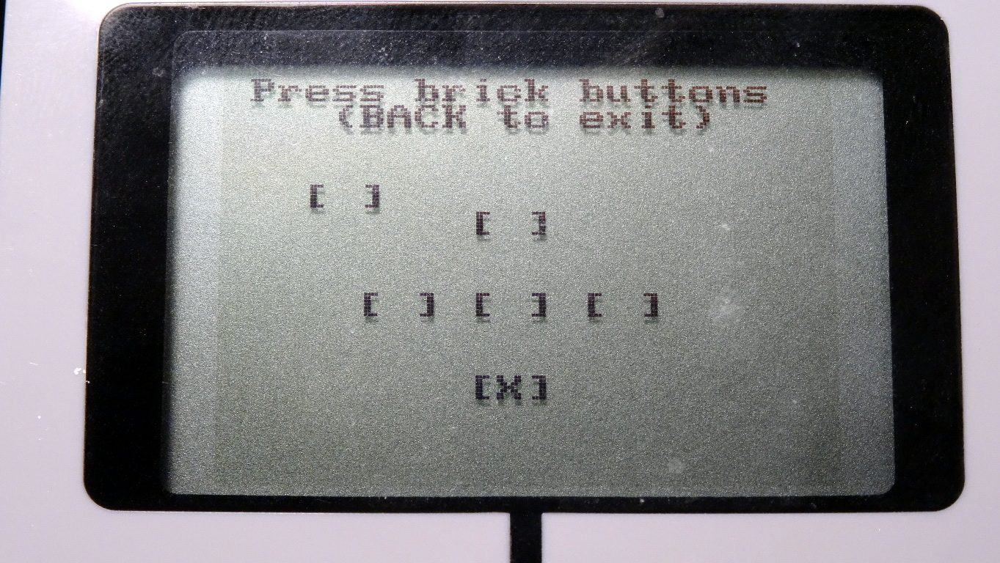
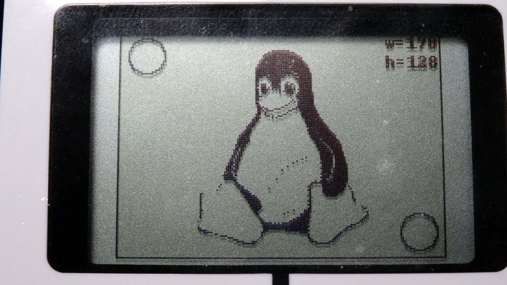

Basic demonstrations
====================

leds.py
-------

Playing with the LEDs using the :py:class:`ev3dev.ev3.Leds` class.

motors.py
---------

Basic motions of the motors using the :py:class:`ev3dev.motors.LargeMotor` class.

buttons.py
----------

Shows how to use the EV3 buttons related classes.

It displays the current state of the buttons, using a text based interface
created with `curses` (see https://docs.python.org/2/library/curses.html).

draw.py
-------

Using the :py:class:`ev3dev.display.Screen` class to draw graphical stuff
on the LCD.

